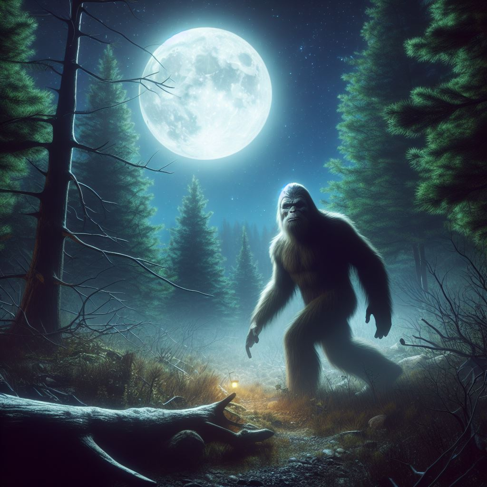

# Bigfoot Sightings Visualizations

## Project Overview

This repository is dedicated to the exploration and visualization of Bigfoot sightings across the United States. Utilizing a variety of data visualization techniques, this project aims to uncover patterns and insights into the mysterious phenomenon of Bigfoot sightings. From heatmaps to word clouds, each file within this repository contributes to a comprehensive analysis of sighting reports, terrain features, witness accounts, and even the correlation of sightings with lunar phases.

[View Visualization](https://nguyenlamvu88.github.io/dsci550_assignment_3_visualizations/dsci550_bigfoot_sightings_visualizations.html)

### Visualizations

Below is a detailed overview of each visualization provided in this repository, including descriptions and direct links to view them online.

#### [Bigfoot Sightings Overview](https://nguyenlamvu88.github.io/dsci550_assignment_3_visualizations/dsci550_bigfoot_sightings_visualizations.html)

- `dsci550_bigfoot_sightings_visualizations.html`: The main visualization page offering a holistic view of Bigfoot sightings data.

#### Additional Visualizations

- `entities_wordcloud.html`: Displays a word cloud of entities related to Bigfoot sightings, offering insights into common themes and descriptors.
- `sightings_heatmap.html`: Showcases a heatmap of Bigfoot sightings locations, highlighting areas with higher concentrations of reports.
- `sightings_moonphases.html`: Presents visualizations correlating Bigfoot sightings with moon phases, exploring potential patterns.
- `sightings_terrain_features.html`: Displays terrain features associated with Bigfoot sightings, providing context on the geographic distribution.
- `witness_count_squares.html`: Shows the count of witnesses in square areas, helping to quantify sightings.

### Resources & References

- `us_cave_karst.png`: A map of caves and karst networks in the U.S., sourced from [Data Bayou](https://databayou.com/caves/usa.html).

### Project Assets

- `bigfoot_background_v2.png`: Background image used across the project's web interface.
- `usc-primary-logotype.svg`: The logo of the University of Southern California (USC), utilized in project presentations.

## Acknowledgments

This project is a part of the academic work conducted at the University of Southern California (USC). Special thanks to all contributors and data sources that made this project possible.

For further information or inquiries, feel free to contact vulnguye@usc.edu.

---
